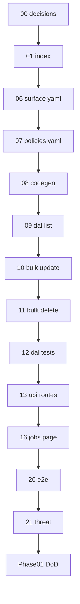

# 01 — Task index (read once)

## Goal

Orient the Phase 01 `job_list` task chain. **Do not implement code in this file.**

## Prerequisites

- [00-decisions.md](./00-decisions.md) complete.
- Skim [phase README](../README.md) and archived pilot: [`../../../archive/step-3-pilot-surface.md`](../../../archive/step-3-pilot-surface.md).

## Execution order

```
00-decisions (docs)
  → 06-surface-yaml → 07-policies-yaml → 08-codegen
  → 09-dal-list → 10-dal-bulk-update → 11-dal-bulk-delete → 12-dal-contract-tests
  → 13-api-routes → 16-jobs-list-page
  → 20-e2e-job-list → 21-threat-tests
```

## Dependency diagram



## Full table

| # | Task | Type |
|---|------|------|
| 00 | [00-decisions.md](./00-decisions.md) | Docs |
| 01 | [01-task-index.md](./01-task-index.md) | Docs |
| 06 | [06-surface-yaml.md](./06-surface-yaml.md) | Metadata |
| 07 | [07-policies-yaml.md](./07-policies-yaml.md) | Metadata |
| 08 | [08-codegen.md](./08-codegen.md) | Code |
| 09 | [09-dal-list.md](./09-dal-list.md) | Code |
| 10 | [10-dal-bulk-update.md](./10-dal-bulk-update.md) | Code |
| 11 | [11-dal-bulk-delete.md](./11-dal-bulk-delete.md) | Code |
| 12 | [12-dal-contract-tests.md](./12-dal-contract-tests.md) | Code |
| 13 | [13-api-routes.md](./13-api-routes.md) | Code |
| 16 | [16-jobs-list-page.md](./16-jobs-list-page.md) | Code |
| 20 | [20-e2e-job-list.md](./20-e2e-job-list.md) | Code |
| 21 | [21-threat-tests.md](./21-threat-tests.md) | Code |

## Omitted pilot tasks (reuse, do not re-run)

| Pilot # | Reason |
|---------|--------|
| 02–05 | Phase 00 / `job_detail` pilot — `@latch/contracts`, `@latch/policy`, DB, audit skeleton exist |
| 04-db-schema | Reuse [`../../../../apps/web/migrations/001_init.sql`](../../../../../apps/web/migrations/001_init.sql) |
| 14-server-action | Bulk is REST-first ([`../../../reference/api-style.md`](../../../reference/api-style.md)); add only if `/jobs` bulk UI needs Server Actions |
| 15-stub-principal | [`../../../../apps/web/src/lib/auth/getPrincipal.ts`](../../../../../apps/web/src/lib/auth/getPrincipal.ts) |
| 17–19 | Audit triggers, approval, react gates — extend only if list page needs gates beyond detail patterns |

## Reuse map (Phase 00 / pilot)

| Artifact | Location |
|----------|----------|
| Single-record DAL | [`packages/dal/src/jobs/repository.ts`](../../../../dal/src/jobs/repository.ts) |
| Row visibility | `rowVisibleToPrincipal` in repository |
| Stub principal | [`apps/web/src/lib/auth/getPrincipal.ts`](../../../../../apps/web/src/lib/auth/getPrincipal.ts) |
| Latch wiring | [`apps/web/src/lib/latch.ts`](../../../../../apps/web/src/lib/latch.ts) |
| Detail API pattern | [`apps/web/src/app/api/jobs/[id]/route.ts`](../../../../../apps/web/src/app/api/jobs/[id]/route.ts) |
| Policy seeds | [`job_detail.policies.yaml`](../../../../../apps/web/modules/job/job_detail.policies.yaml) (mirror row scopes) |
| Threat harness | [`tests/threat.test.ts`](../../../../../tests/threat.test.ts) |
| Pilot task archive | [`../../../archive/tasks/job_detail/`](../../../../../docs/archive/tasks/job_detail) |

## STATUS discipline

After each task's **Verify** section passes:

1. Check off verify items in the task file.
2. Update [`../STATUS.md`](../STATUS.md): **Execute now** → next task filename; move completed task to **Recently completed**.
3. Update root [`../../../STATUS.md`](../../../../../docs/STATUS.md) only when Phase 01 definition of done is complete (repoint active phase).

## Commands cheat sheet

| Command | When |
|---------|------|
| `npm run codegen` | After task 06–07 YAML changes (task 08) |
| `npm run codegen:check` | After 08; required in CI (task 21) |
| `npm run test` | After 12, 20, 21 |
| `npm run build` | Task 21 / CI |

Example verify for task 13 (stub principal env):

```bash
# field tech — list without financial columns, assigned rows only
curl -s -H "x-latch-stub-user: tech-a" -H "x-latch-stub-role: field_tech" \
  "http://localhost:3000/api/jobs?limit=50" | jq '.data[0] | keys'

# office admin — bulk partial
curl -s -X PATCH -H "Content-Type: application/json" \
  -H "x-latch-stub-user: admin" -H "x-latch-stub-role: office_admin" \
  -d '{"ids":["..."],"patch":{"assignments":{"user_id":"tech-b"}},"mode":"partial"}' \
  "http://localhost:3000/api/jobs:bulk"
```

(Adjust stub header names to match [`getPrincipal.ts`](../../../../../apps/web/src/lib/auth/getPrincipal.ts).)

## Verify (stop gate)

- [x] You know which file [`../STATUS.md`](../STATUS.md) points to as **Execute now**
- [x] You will update **STATUS** after each task's Verify section passes

## Out of scope

Implementation work — use tasks 06–21.
