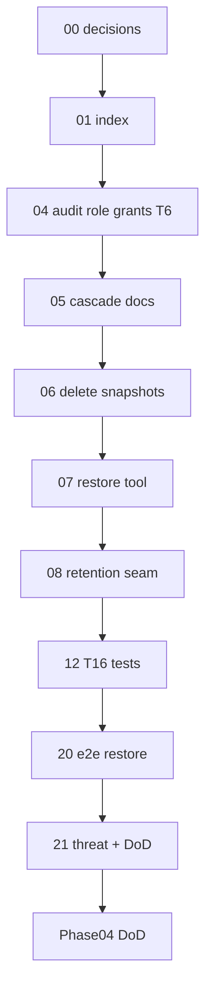

# 01 — Task index (read once)

## Goal

Orient the Phase 04 Audit & lifecycle task chain. **Do not implement code in this file.**

## Prerequisites

- [00-decisions.md](./00-decisions.md) complete (Verify gate passed).
- Phase 03 complete ([`../../03-identity-iam/STATUS.md`](../../03-identity-iam/STATUS.md)).
- Skim the [phase README](../README.md) and [`../decisions.md`](../decisions.md).

## Execution order

```
00-decisions (docs)
  → 04-audit-role-grants → 05-cascade-docs
  → 06-delete-audit-snapshots → 07-restore-tool
  → 08-retention-seam
  → 12-delete-audit-tests (T16)
  → 20-e2e-restore → 21-threat-t6-t16-phase-dod
```

## Dependency diagram



## Full table

| # | Task | Type | Delivers |
|---|------|------|----------|
| 00 | [00-decisions.md](./00-decisions.md) | Docs | Lock cascade, snapshots, restore, T6, retention seam, Phase 05 boundary |
| 01 | [01-task-index.md](./01-task-index.md) | Docs | This index |
| 04 | [04-audit-role-grants.md](./04-audit-role-grants.md) | Code | `latch_app` role; INSERT-only on `latch_audit`; T6 CI as app role |
| 05 | [05-cascade-docs.md](./05-cascade-docs.md) | Docs | Per-Surface cascade table in reference + `DATABASE.md` |
| 06 | [06-delete-audit-snapshots.md](./06-delete-audit-snapshots.md) | Code | `before` embeds CASCADE children (`assignments`, `sites`, …) |
| 07 | [07-restore-tool.md](./07-restore-tool.md) | Code | `@latch/audit` restore API + CRM script; `restore` audit row |
| 08 | [08-retention-seam.md](./08-retention-seam.md) | Code/Docs | `auditRetentionYears` seam; partition sketch documented |
| 12 | [12-delete-audit-tests.md](./12-delete-audit-tests.md) | Code | **T16** single + bulk delete audit presence |
| 20 | [20-e2e-restore.md](./20-e2e-restore.md) | Code | E2E: delete job → restore → row visible again |
| 21 | [21-threat-t6-t16-phase-dod.md](./21-threat-t6-t16-phase-dod.md) | Code | **T6** + **T16** + phase README DoD; repoint root STATUS → Phase 05 |

## Omitted / reuse (do not re-run)

| Artifact | Location |
|----------|----------|
| `writeAudit`, `AuditAction` types | [`packages/audit`](../../../../audit) |
| `deleteRowWithAudit`, bulk delete audit | [`packages/dal/src/delete-row.ts`](../../../../dal/src/delete-row.ts), [`bulk.ts`](../../../../dal/src/bulk.ts) |
| `latch_audit` + immutability trigger | [`apps/crm/migrations/001_init.sql`](../../../../../apps/crm/migrations/001_init.sql) |
| Postgres audit writer | [`apps/crm/src/lib/audit-db-writer.ts`](../../../../../apps/crm/src/lib/audit-db-writer.ts) |
| T6 partial test | [`tests/threat.test.ts`](../../../../../tests/threat.test.ts) |
| Hard-delete global decision | [`../../../foundations/scope.md`](../../../foundations/scope.md) (2026-05-30) |
| `restore` on `office_admin` | [`apps/crm/modules/job/job_detail.policies.yaml`](../../../../../apps/crm/modules/job/job_detail.policies.yaml) |
| `approve` / `reject` audit wiring | Phase 05 — [`../../05-verification/README.md`](../../05-verification/README.md) |

## CRM proof mapping

| Phase 04 deliverable | CRM |
|---------------------|-----|
| Restore tool | **Optional** admin page only if added later — v1 is **script/API + tests** ([`../../../reference/crm-and-phases.md`](../../../reference/crm-and-phases.md)) |
| Delete + audit | Reuse existing jobs detail delete; verify `latch_audit` row in Postgres path |

## Phase 05 coordination

Do not implement `approve` / `reject` audit rows in Phase 04 except documenting the contract in [`../decisions.md`](../decisions.md). Phase 05 **STATUS** lists audit linkage on accept as a blocker until Phase 04 action types + immutability are proven.

## STATUS discipline

After each task's **Verify** section passes:

1. Check off verify items in the task file.
2. Add **Status** line under the task title (`Complete (YYYY-MM-DD). Next: …`).
3. Update [`../STATUS.md`](../STATUS.md): **Execute now** → next task; **Recently completed** ← finished task.
4. Update root [`../../../../STATUS.md`](../../../../../STATUS.md) only when Phase 04 definition of done is complete.

## Commands cheat sheet

| Command | When |
|---------|------|
| `npm run test` | After 04, 06, 07, 12, 20, 21 |
| `npm run build` | Task 21 / CI |
| `npm run restore-audit` (TBD) | After task 07 — document in task file |
| `psql "$DATABASE_URL" -c "… latch_audit …"` | Manual delete/restore verification ([`apps/crm/docs/TASKS.md`](../../../../../apps/crm/docs/TASKS.md)) |

## Verify (stop gate)

- [ ] You know which file [`../STATUS.md`](../STATUS.md) names as **Execute now**
- [ ] You will update **STATUS** after each task's Verify section passes

## Out of scope

Implementation work — use tasks 04–21. CRM restore UI, business-table triggers, GDPR erasure, automated partition drops, Phase 05 pending store.
