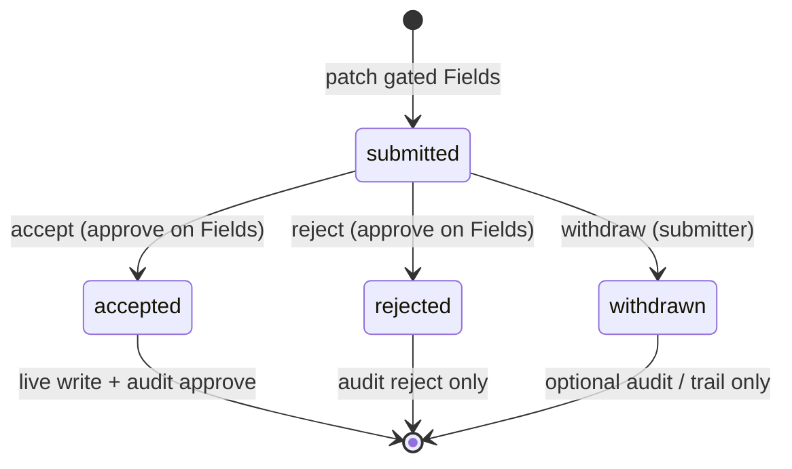

# 00 — Lock Phase 05 Verification decisions

> **Status:** Complete (2026-06-02). Next: [`04-db-schema.md`](./04-db-schema.md).

## Goal

Record pending storage, metadata-driven verification gates (hybrid YAML + manifest), reviewer/submitter UX, state machine, bulk behavior, audit linkage, threat scope, and Phase 06 boundary so tasks **04–21** do not re-debate them. **Docs only — do not add application code.**

## Prerequisites

- Phase 04 complete ([`../../04-audit-lifecycle/STATUS.md`](../../04-audit-lifecycle/STATUS.md)).
- Skim the [phase README](../README.md), [`../decisions.md`](../decisions.md), and [`../../../reference/approval-trails.md`](../../../../approval/docs/approval-trails.md).

## Files (docs only — do not add application code)

| File | Action |
|------|--------|
| [`../decisions.md`](../decisions.md) | Open items → **Decided** table + Decision blocks |
| [`../../../reference/approval-trails.md`](../../../../approval/docs/approval-trails.md) | Storage decision; Surface terminology; state machine; visibility rules |
| [`../../../foundations/open-questions.md`](../../../foundations/open-questions.md) | Resolve approval rows (submitter edit, expiry) |
| [`../STATUS.md`](../STATUS.md) | After verify: **Execute now** → `04-db-schema.md` |

## Decisions to lock (copy into [`../decisions.md`](../decisions.md))

### 1. Product choices (planning gate 2026-06-02)

| Topic | Choice |
|-------|--------|
| **Reviewer UX (1)** | **Minimal `job_detail` UI** — field_tech can propose; office_admin accept/reject on that job. APIs + tests still required. No global pending inbox in v1. |
| **Withdraw (2)** | **Yes** — submitter may **withdraw** while `status = submitted`; terminal `withdrawn`; optional audit (see §8). |
| **Reject audit (3)** | **Always** — every `reject` writes `writeAudit({ action: 'reject', … })`; live row unchanged. |
| **Pending visibility (4)** | **Role-split (D)** — submitter with `submit` sees own proposed values on entities they can read; principals without `approve` do not see others' pending patches; reviewers see queue for accept/reject. |
| **Gating source (5)** | **Hybrid (C)** — Surface YAML marks Field **`requires_verification`** (codegen → `verificationFieldIds`); at runtime route to pending when manifest has **`submit`** and not **`write`** on that Field for the patch. YAML alone does not force pending for roles with direct `write`. |
| **Gate scope (6)** | **Field-level only** — split patch: gated Fields → pending; other Fields in same PATCH apply live. Surface-wide “all fields pending” deferred. |
| **Concurrency (7)** | **One open `submitted` per `(surface_id, entity_id)`**; second submit while open → **409**. After **reject**, resubmit creates **new** row with optional **`supersedes_id`**. |
| **Bulk (8)** | **In Phase 05 DoD** — bulk update on gated Fields creates per-row pending + shared **`batch_id`**; accept/reject per row. |
| **Pending immutability (9)** | **DAL-only (T7)** for v1 — no UPDATE on terminal rows; no public PATCH pending API; optional DB trigger deferred. |
| **Reject comment (10)** | **Optional** `comment` column / API field on reject (and withdraw if stored). |
| **Codegen (11)** | **`requires_verification: true` on Field** in `*.surface.yaml` → generated constants used by DAL/tests. |
| **Phase 06 boundary (12)** | **No manifest cache or RLS work** in Phase 05. Writes continue to re-resolve manifest (T3). |
| **Naming (13)** | **Surface** (not Module) in docs touched this phase; `surface_id` column on `latch_pending_changes`. |

### 2. `latch_pending_changes` schema (v1)

| Column | Type | Purpose |
|--------|------|---------|
| `id` | `UUID` PK | Same id as `latch_audit.approval_id` on accept |
| `surface_id` | `TEXT` NOT NULL | Surface id (e.g. `job_detail`) |
| `entity_id` | `TEXT` NOT NULL | Anchor row id |
| `field_ids` | `TEXT[]` NOT NULL | Gated Field ids in this bundle (all-or-nothing) |
| `patch` | `JSONB` NOT NULL | Proposed values (strict shape at DAL) |
| `status` | `TEXT` NOT NULL | `submitted` \| `accepted` \| `rejected` \| `withdrawn` |
| `submitted_by` | `TEXT` NOT NULL | Principal id |
| `submitted_at` | `TIMESTAMPTZ` NOT NULL | |
| `decided_by` | `TEXT` | Reviewer or submitter (withdraw) |
| `decided_at` | `TIMESTAMPTZ` | |
| `comment` | `TEXT` | Optional reject (or withdraw) note |
| `batch_id` | `UUID` | Set when created from bulk; nullable for single patch |
| `supersedes_id` | `UUID` FK → `latch_pending_changes.id` | Prior pending after reject/resubmit chain |

**Indexes:** `(surface_id, entity_id, status)` where `status = 'submitted'` (enforce one open via app logic + unique partial index if desired in task **04**).

**Immutability:** After terminal status, DAL refuses `resolve` / `withdraw` / any update. No app-facing UPDATE route.

### 3. State machine

- **No `draft`** in v1 — submit creates `submitted` immediately.
- **Resubmit** after `rejected` or `withdrawn` → new row, `supersedes_id` optional link.

### 4. DAL routing (hybrid gating)

1. Codegen exports **`verificationFieldIds`** (or per-Surface set) from Fields with `requires_verification: true`.
2. On `patch` / `bulkUpdate`, for each Field in the patch that is in the verification set:
   - If `fieldAllows(manifest, fieldId, 'write')` → apply live (subject to normal strict write).
   - Else if `fieldAllows(manifest, fieldId, 'submit')` → extract to pending bundle (merge gated keys into one pending record per entity per request).
   - Else → `ForbiddenError`.
3. **T10 guard:** Direct write to a verification Field without going through `acceptPending` internal applier path is forbidden even if a buggy descriptor omits `pendingWrite` hook — platform check in `createSurfaceDal`.
4. **`acceptPending`:** Re-resolve manifest; require `approve` on all `field_ids`; apply patch in transaction; `resolve(accepted)`; `writeAudit({ action: 'approve', approvalId })`.
5. **`rejectPending`:** Same authz as accept; `resolve(rejected)`; `writeAudit({ action: 'reject' })`; no live write.
6. **`withdrawPending`:** Submitter only (`submitted_by` match or `submit` on Fields); `resolve(withdrawn)`; audit optional (recommend lightweight `reject`-style row or dedicated action — use **`reject`** with `comment` prefix `withdraw:` **or** omit audit in v1; task **08** picks one and documents).

**Pilot:** `job_detail` — `financial_terms.requires_verification: true`; replace hand-written `pendingWrite` in [`descriptors.ts`](../../../../../apps/crm/src/lib/jobs/descriptors.ts) with generated/metadata-driven behavior.

### 5. Pending visibility in DTOs

| Principal | Sees on GET/list |
|-----------|------------------|
| Submitter (`submit`, not `write` on Field) | Own open pending values for gated Fields on visible rows (e.g. proposed `contract_amount`) |
| Reviewer (`approve` on Field) | Open pending for accept/reject UI (same patch payload) |
| Others | Live data only; no pending patch leakage |

Implementation: projection helper or manifest-aware `projectRow` extension in task **11** — not a security boundary alone; DAL must not include pending in JSON for unauthorized principals.

### 6. Bulk + `batch_id`

Per [`../../../reference/bulk-operations.md`](../../../../dal/docs/bulk-operations.md): gated bulk patch → **N** pending rows, same `batch_id`. Reviewer accepts/rejects **per row** in v1. Live Fields in the same bulk patch still apply per existing bulk algorithm when not gated.

### 7. Storage adapter

| Environment | Pending store |
|-------------|---------------|
| Tests / no DB URL | `createMemoryPendingStore()` (existing) |
| CRM with `DATABASE_URL` | `createPostgresPendingStore()` — survives restart; shared across workers |

Jobs pilot may remain `MemoryJobStore`; pending table is still Postgres when URL set (mirror audit writer pattern in [`latch.ts`](../../../../../apps/crm/src/lib/latch.ts)).

### 8. Audit linkage (Phase 04 handoff)

| Event | `latch_audit.action` | Live data |
|-------|----------------------|-----------|
| Accept | `approve` | Updated; `approval_id` = pending id |
| Reject | `reject` | Unchanged |
| Withdraw | **TBD in task 08** — prefer `reject` with metadata or skip row | Unchanged |
| Submit | No live change | Optional: no audit in v1 (pending row is trail) |

### 9. Threat tests in scope

| Id | Phase 05 deliverable |
|----|----------------------|
| **T7** | Cannot mutate terminal pending; duplicate submit → 409 |
| **T10** | Direct write to verification Field without applier path → forbidden |
| **T3** | Already partial on `acceptPending` — extend for reject/withdraw |

### 10. Deferred (explicit)

| Item | Where |
|------|--------|
| Submitter **edit** of pending row | v1: withdraw + resubmit only |
| Expiry / auto-reject | `open-questions.md` deferred |
| Surface-wide verification gate | Post–v1 metadata |
| Global pending inbox UI | Post–v1 |
| DB trigger on `latch_pending_changes` | Optional; not Phase 05 DoD |
| Manifest cache, RLS | Phase 06 |
| External reviewers, partial accept | [`../../../foundations/scope.md`](../../../foundations/scope.md) |

### 11. CRM proof mapping

| Deliverable | CRM |
|-------------|-----|
| APIs | `GET /api/pending`, `POST …/accept`, `reject`, `withdraw` (exact paths in task **10**) |
| UI | `job_detail` only — propose + accept/reject strip (task **11**) |
| E2E | field_tech submit → admin accept; reject path; bulk pending (task **20**) |

## Verify (stop gate)

- [x] No unchecked items in [`../decisions.md`](../decisions.md) **Open / to lock** section
- [x] Decision blocks in `decisions.md` match §1–§11 above
- [x] [`../../../reference/approval-trails.md`](../../../../approval/docs/approval-trails.md) updated (storage + Surface terms)
- [x] [`../STATUS.md`](../STATUS.md) **Execute now** → `04-db-schema.md`
- [x] No new files under `packages/*` or `apps/crm/src` from this task (docs-only)

## Out of scope

Migrations, DAL changes, UI, and tests (tasks **04**+). Manifest cache and RLS (Phase 06).
