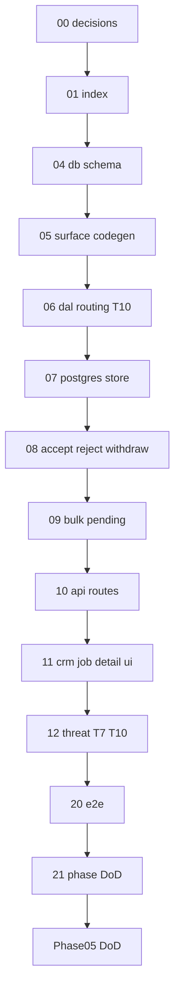

# 01 — Task index (read once)

> **Status:** Complete (2026-06-02). Next: [04-db-schema.md](./04-db-schema.md).

## Goal

Orient the Phase 05 Verification task chain. **Do not implement code in this file.**

## Prerequisites

- [00-decisions.md](./00-decisions.md) complete (Verify gate passed).
- Phase 04 complete ([`../../04-audit-lifecycle/STATUS.md`](../../04-audit-lifecycle/STATUS.md)).
- Skim the [phase README](../README.md) and [`../decisions.md`](../decisions.md).

## Execution order

```
00-decisions (docs)
  → 04-db-schema
  → 05-surface-codegen
  → 06-dal-pending-routing
  → 07-postgres-pending-store
  → 08-accept-reject-withdraw
  → 09-bulk-pending
  → 10-api-routes
  → 11-crm-job-detail-ui
  → 12-threat-t7-t10
  → 20-e2e-verification
  → 21-phase-dod
```

## Dependency diagram



## Full table

| # | Task | Type | Delivers |
|---|------|------|----------|
| 00 | [00-decisions.md](./00-decisions.md) | Docs | Lock storage, hybrid gating, UX, bulk, T7/T10 scope, Phase 06 boundary |
| 01 | [01-task-index.md](./01-task-index.md) | Docs | This index |
| 04 | [04-db-schema.md](./04-db-schema.md) | Code | Migration `latch_pending_changes`; `DATABASE.md` |
| 05 | [05-surface-codegen.md](./05-surface-codegen.md) | Metadata/Code | `requires_verification` on `financial_terms`; codegen emits verification set |
| 06 | [06-dal-pending-routing.md](./06-dal-pending-routing.md) | Code | Metadata-driven pending in `createSurfaceDal`; **T10** platform guard; remove pilot `pendingWrite` hook |
| 07 | [07-postgres-pending-store.md](./07-postgres-pending-store.md) | Code | `@latch/approval` Postgres store; CRM `latch.ts` wiring |
| 08 | [08-accept-reject-withdraw.md](./08-accept-reject-withdraw.md) | Code | `rejectPending`, `withdrawPending`; transactional accept; **reject** audit always |
| 09 | [09-bulk-pending.md](./09-bulk-pending.md) | Code | Bulk gated Fields → per-row pending + `batch_id` |
| 10 | [10-api-routes.md](./10-api-routes.md) | Code | List / accept / reject / withdraw HTTP routes |
| 11 | [11-crm-job-detail-ui.md](./11-crm-job-detail-ui.md) | Code | field_tech **submit** + office_admin accept/reject strip; role-split pending visibility |
| 12 | [12-threat-t7-t10.md](./12-threat-t7-t10.md) | Code | Threat **T7**, **T10** (+ extend T3 on reject/withdraw) |
| 20 | [20-e2e-verification.md](./20-e2e-verification.md) | Code | E2E: submit → accept; reject; bulk pending |
| 21 | [21-phase-dod.md](./21-phase-dod.md) | Code | Phase README DoD; repoint root STATUS → Phase 06 |

## Omitted / reuse (do not re-run)

| Artifact | Location |
|----------|----------|
| `MemoryPendingStore`, `PendingStore` interface | [`packages/approval/src/pending-store.ts`](../../../../approval/src/pending-store.ts) |
| `acceptPending`, patch → pending split | [`packages/dal/src/create-surface-dal.ts`](../../../../dal/src/create-surface-dal.ts) |
| `submit` / `approve` policy on `financial_terms` | [`apps/crm/modules/job/job_detail.policies.yaml`](../../../../../apps/crm/modules/job/job_detail.policies.yaml) |
| `AuditAction` `approve` / `reject` | [`packages/audit/src/types.ts`](../../../../audit/src/types.ts) |
| Repository tests (submit + accept) | [`apps/crm/src/lib/jobs/repository.test.ts`](../../../../../apps/crm/src/lib/jobs/repository.test.ts) |
| Partial T3 on accept | [`tests/threat.test.ts`](../../../../../tests/threat.test.ts) |
| Phase 04 audit immutability | [`../../04-audit-lifecycle/`](../../../../../docs/phases/04-audit-lifecycle) |

## CRM proof mapping

| Phase 05 deliverable | CRM |
|---------------------|-----|
| Pending persistence | Postgres when `DATABASE_URL` set (jobs may stay memory store) |
| Pilot Surface | `job_detail` + `job_list` bulk on `financial_terms` |
| UI | **Minimal** job detail only — no `/pending` inbox page |

## STATUS discipline

After each task's **Verify** section passes:

1. Check off verify items in the task file.
2. Add **Status** line under the task title (`Complete (YYYY-MM-DD). Next: …`).
3. Update [`../STATUS.md`](../STATUS.md): **Execute now** → next task; **Recently completed** ← finished task.
4. Update root [`../../../../STATUS.md`](../../../../../STATUS.md) only when Phase 05 definition of done is complete.

## Commands cheat sheet

| Command | When |
|---------|------|
| `npm run codegen` | After task **05** |
| `npm run codegen:check` | Task **21** / CI |
| `npm run test` | After **06**, **08**, **09**, **12**, **20**, **21** |
| `npm run build` | Task **21** |

## Verify (stop gate)

- [x] You know which file [`../STATUS.md`](../STATUS.md) names as **Execute now**
- [x] You will update **STATUS** after each task's Verify section passes

## Out of scope

Implementation work — use tasks **04–21**. Manifest cache, RLS, global pending inbox, external reviewers, partial field accept, pending DB triggers (optional).
