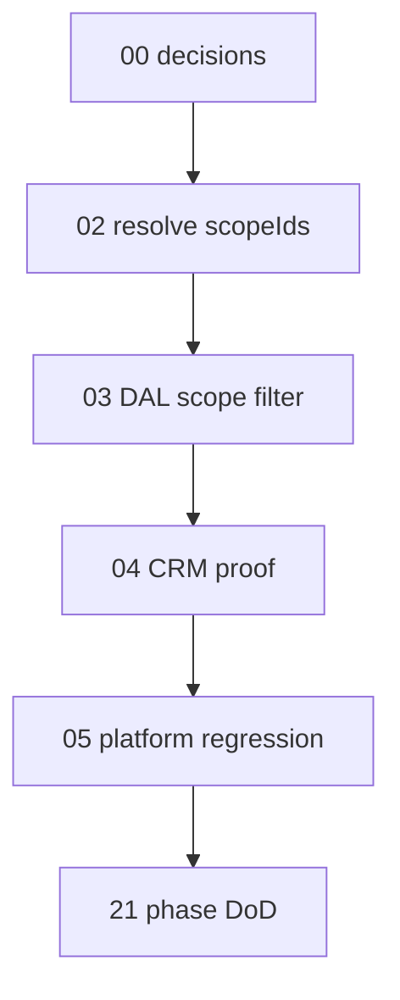

# 01 — Task index (Phase 08)

> **Status:** Complete (2026-06-10). Phase closed — [21-phase-dod.md](./21-phase-dod.md).

## Goal

Orient the Phase 08 task chain. **Do not implement code in this file.**

## Prerequisites

- [00-decisions.md](./00-decisions.md) complete.
- Policy task 05 Phase A + spike task 08 complete.
- Skim [phase README](../README.md).

## Execution order

```
00-decisions (docs)
  → 02-resolve-scope-ids        (@latch/policy)
  → 03-dal-scope-filter         (@latch/dal)
  → 04-crm-scoped-proof         (apps/spike_business)
  → 05-platform-regression      (policy + dal tests; task 05 closeout)
  → 21-phase-dod
```

## Package task cross-links

| Phase task | Package task |
|------------|--------------|
| [02](./02-resolve-scope-ids.md) | [`05b-scoped-rls-resolve`](../../../../policy/docs/tasks/05b-scoped-rls-resolve.md) |
| [03](./03-dal-scope-filter.md) | [`01-scoped-row-filter`](../../../../dal/docs/tasks/01-scoped-row-filter.md) |
| [05](./05-platform-regression.md) | [`05c-policy-closeout`](../../../../policy/docs/tasks/05c-policy-closeout.md) |

## Dependency diagram



## Out of this chain

- Spike UI — complete ([task 08](../../../../../apps/spike_policy/docs/tasks/08-scoped-delegation.md))
- Postgres RLS — Phase 07
- `CachingPolicyService` in spike — optional; CRM already wires cache (Phase 06)
