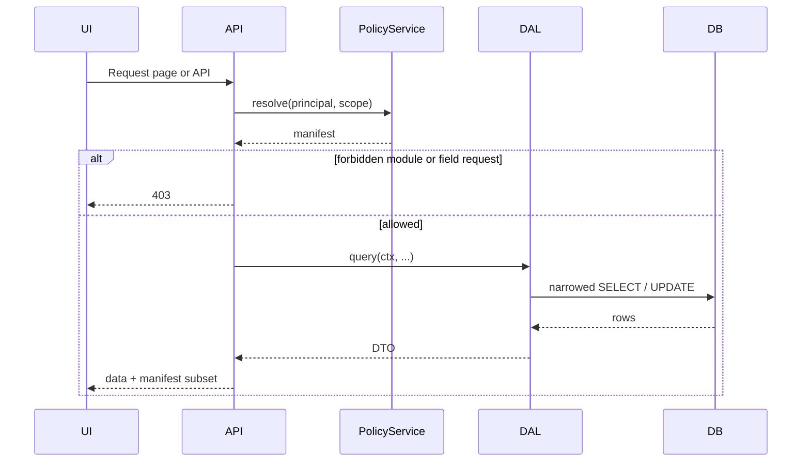

# Permissions, DAL, and UI sync

How Latch keeps **backend authorization**, **data access**, **validation**, and **frontend rendering** aligned. Complements [access-control.md](../../policy/docs/access-control.md).

## Problem

Database enforcement alone does not tell the UI which controls to show, which fields are read-only, or which nav routes exist. A separate front-end permission hack drifts from the API. Latch treats permissions as a **cross-cutting contract**: resolve once, use everywhere, never send unauthorized data.

## Core concepts

| Concept | Description |
|---------|-------------|
| **Effective access (manifest)** | Server-computed permissions for the current principal: Modules, Fields, actions (`read`, `write`, …). |
| **Permission context** | Request-scoped object carrying principal + manifest; required for every DAL call. |
| **DAL** | Data access layer — the only application entry point to business data. Narrows queries/updates from the manifest. |
| **PolicyService** | Server-only evaluator: principal + roles + metadata → manifest. |

The UI receives a **copy of permissions** (manifest or safe subset). It does **not** run policy rules in production for security decisions, and it **never** receives field values the user is not allowed to read.

## Decision: server-only policy evaluation (2026-05)

**Choice:** `PolicyService.resolve()` runs on the server only. The client consumes a serialized **manifest** for rendering.

**Rationale:** Security must not depend on browser-side rule evaluation. One implementation avoids drift between “what the UI thinks” and “what the API allows.”

### Decision: manifest delivery via RSC props (2026-05-27)

**Choice:** Prefer passing the manifest from **Server Components** (layout/page props → `CapabilitiesProvider`). Use client fetch only when RSC is impractical (e.g. highly dynamic client-only subtree).

**Rationale:** Fewer round-trips, manifest aligned with route scope, fits Next.js App Router. Invariant unchanged: permissions resolved before render and before DAL.

See [global-options.md](../foundations/global-options.md).

## Decision: manifest scope — page + nav (2026-05)

**Choice:**

1. **Page / route:** The UI receives only what the current page needs (Module scope, Field actions relevant to that screen).
2. **Navigation:** Menu data includes **only routes the user may access** (Module-level or route-level `read` / open permission).
3. **Global options:** Platform config may widen or narrow what is sent (e.g. full app manifest vs strict page-only). Defaults favor **minimal exposure**.

**Rationale:** Avoids leaking module structure and field IDs beyond what the screen requires; nav stays consistent with API gates.

**Example — page manifest (contract detail):**

```json
{
  "module": "contract",
  "entityId": "uuid-1",
  "actions": ["read"],
  "fields": {
    "title": ["read", "write"],
    "internal_notes": ["read"],
    "salary_band": []
  }
}
```

`salary_band` has no `read` → not in API response, not in JSON to the client, control not rendered (or not wired).

**Example — nav payload:**

```json
{
  "routes": [
    { "id": "contracts", "href": "/contracts", "label": "Contracts" }
  ]
}
```

No `hr_admin` entry if the user lacks that Module.

## Decision: data never transmitted without read (2026-05)

**Choice:**

| Situation | Behavior |
|-----------|----------|
| No `read` on Field | Omit from DTO and HTTP response; do not render value control (or render nothing). |
| `read` but no `write` | Include value; UI renders **read-only** control. |
| Client requests forbidden Field (query param, `fields=`, PATCH key) | **403** at API/DAL gate (re-authorize on every request). |

**Rationale:** Hiding in the UI is not security. Omitting at the DAL/query layer ensures unauthorized data never leaves the server. Explicit asks for forbidden Fields fail loudly.

**Optional (global config):** Stricter **404** semantics to avoid confirming a Field exists — not default; document per sensitivity class if used.

## Decision: permissions before database (2026-05)

**Choice:** Resolve manifest **before** any business DAL call. No DAL method runs without a `PermissionContext`.

**Flow:**



## Decision: DAL + optional RLS hybrid (2026-05)

**Choice:** Application code uses a **DAL** that enforces Field- and row-level rules from the manifest. PostgreSQL **RLS** (where adopted) is a **safety net** for tenant/row isolation, not the sole mechanism for Field-level UI sync.

| Layer | Owns |
|-------|------|
| Manifest + DAL | Field read/write, DTO shape, PATCH allowlist, UI contract |
| RLS (optional) | Tenant/row rules; limits damage if DAL is bypassed |
| UI | Render from manifest; not a security boundary |

See [postgres-rls-and-security.md](../discovery/postgres-rls-and-security.md).

## Decision: reject unknown keys on write (2026-05)

**Choice:** All write bodies (POST/PATCH/PUT) use a **writable** Zod schema derived from the same manifest as the DAL. **Unknown or non-writable keys are rejected** (`strict` or equivalent), not silently stripped.

**Example attack:**

```json
PATCH { "title": "Ok", "salary_band": 999999 }
```

User has `write` on `title` only → validation error or 403; DAL never updates `salary_band`.

**Rationale:** Makes bypass attempts visible; keeps Zod and DAL aligned.

## Decision: stale manifest and mutations (2026-05)

**Choice:** Every **POST/PATCH/DELETE** re-runs authentication and authorization (fresh manifest or equivalent checks). A tab open with an old UI manifest cannot succeed on submit after permissions were revoked.

**Optional (global options):** Stricter modes — e.g. require `policyVersion` on writes and return **409** with “reload” when admin changed policies mid-session. Default: rely on server re-check → **403** on denied write.

**Rationale:** UI manifest is a **rendering cache**, not a security token.

### Decision: server-side manifest cache (2026-06-03)

**Choice:** `PolicyService.resolve` may be wrapped by a cache (`CachingPolicyService` / `createManifestCache`) controlled by global option **`manifestCacheMode`** (CRM default **`request`**).

| Mode | Behavior |
|------|----------|
| `none` | No cache; every read calls `resolve` |
| `request` | One resolved manifest per cache key per HTTP/RSC request |
| `ttl` | In-process LRU/TTL keyed by `policyVersion` |
| `session` | Seam only — deferred |

**Invariant:** Cache holds **resolved `Manifest` objects only**. It does **not** replace `PermissionContext`, DAL narrowing, strict writes, or forbidden-field omission.

**Writes:** Always bypass the read cache (`stalePolicyOnWrite: recheck`). Mutations (`patch`, `delete`, `acceptPending`, bulk) call `resolve` fresh regardless of mode.

**Cache key:** `(principalId, policyVersion, surfaceId, mode, entityId?)`

- `policyVersion` comes from `latch_policy_version` (bumped on IAM role assign/revoke) and is copied onto `Principal`.
- `mode` (`list` / `detail` / `create`) is required — same surface id resolves differently per mode.
- `entityId` only for entity-scoped detail; list/create omit it.

**Invalidation:** IAM role change bumps `policyVersion` → TTL entries with the old version miss; request-scoped entries die with the request. Stub principals without `policyVersion` use a documented sentinel bucket (task **04**).

**Storage seam:** `ManifestCacheStore` (`get` / `set` / `deleteByVersion`); Phase 06 ships **in-memory** only. Redis / shared cache = Phase 07+.

**Security tier (future):** v1 is single-tier (`request` for CRM). Document env mapping for a future `securityTier`; no multi-tier impl in Phase 06.

See [`../phases/06-performance-safety/decisions.md`](../phases/06-performance-safety/decisions.md), [`../foundations/global-options.md`](../foundations/global-options.md).

### Decision: `policyVersion` on manifest (2026-06-03)

**Choice:** Optional **`manifest.policyVersion`** echo of the version used at resolve time — for future client strict mode, not required in Phase 06 UI.

**Strict write 409 (deferred):** Requiring the client to send `policyVersion` on writes and returning **409** when it lags admin changes is **out of Phase 06**. v1 denied writes after fresh re-resolve return **403**. Phase 06 proves correctness via threat **T3** (cached read + revoke/bump → write 403).

## Decision: RBAC with built-in roles (2026-05)

**Choice:**

- **Built-in roles** (platform-defined), including roles that can always access **IAM/metadata tables** and/or **all business data** (e.g. platform admin, security auditor — exact set TBD).
- **Users are assigned to roles** (Latch tables and/or mapped from IdP groups).
- App-defined roles extend built-ins for Module/Field policies.

Break-glass / elevated access should use these roles with **enhanced audit** (details TBD in [access-control.md](../../policy/docs/access-control.md)).

## Module metadata and Zod codegen

**Decision (2026-05):** Prefer **codegen from Module definitions** (YAML/JSON in repo) for structural artifacts; hand-write **domain** validation rules where needed.

| Source | Generated (examples) | Hand-written (examples) |
|--------|----------------------|-------------------------|
| `contract.module.yaml` | Field IDs, column map, base `ContractSchema`, nav capability keys | “End date after start date” refinements |

Codegen keeps DAL column lists, Zod shapes, and Field IDs in sync. Runtime **narrows** schemas from manifest:

- `readableSchema(manifest)` — `.pick()` allowed Fields
- `writableSchema(manifest)` — strict write shape

See [metadata-and-codegen.md](../../codegen/docs/reference/metadata-and-codegen.md).

## Packaging (phased)

| Phase | Layout |
|-------|--------|
| Early | `apps/web/modules/<id>/` — Surface YAML, `generated/` schemas, shared types via path alias |
| Later | Extract `@latch/contracts` (client-safe Zod + types), `@latch/policy` and `@latch/dal` (server-only) when multiple apps or publish needed |

Client code may import **contracts** only; never DAL or PolicyService.

## UI integration patterns

| Pattern | Use |
|---------|-----|
| `CapabilitiesProvider` | React context from server-provided manifest |
| `<Can module="contract" action="read">` | Conditional sections |
| `<FieldControl fieldId="title" />` | Reads manifest: hidden / read-only / editable |
| Route layout gate | No page shell if Module not openable |

## API style

The same DAL underlies both **REST route handlers** (public/contract surface) and **Server Actions** (internal RSC sugar). Same manifest, same Zod, same audit. See [`api-style.md`](./api-style.md).

## Bulk operations

Bulk update / hard-delete is part of v1 and obeys the same manifest model — per-row permission evaluation; no shortcut to set-based writes that bypass authorization. See [`bulk-operations.md`](../../dal/docs/bulk-operations.md).

## Related docs

- [`access-control.md`](../../policy/docs/access-control.md) — resource hierarchy, roles
- [`metadata-and-codegen.md`](../../codegen/docs/reference/metadata-and-codegen.md) — Surface YAML → Zod
- [`api-style.md`](./api-style.md) — REST + Server Actions
- [`bulk-operations.md`](../../dal/docs/bulk-operations.md)
- [`overview.md`](../foundations/architecture-overview.md) — system diagram
- [`../threat-model.md`](../foundations/threat-model.md) — controls mapped to threats
- [`../open-questions.md`](../foundations/open-questions.md) — remaining TBDs
